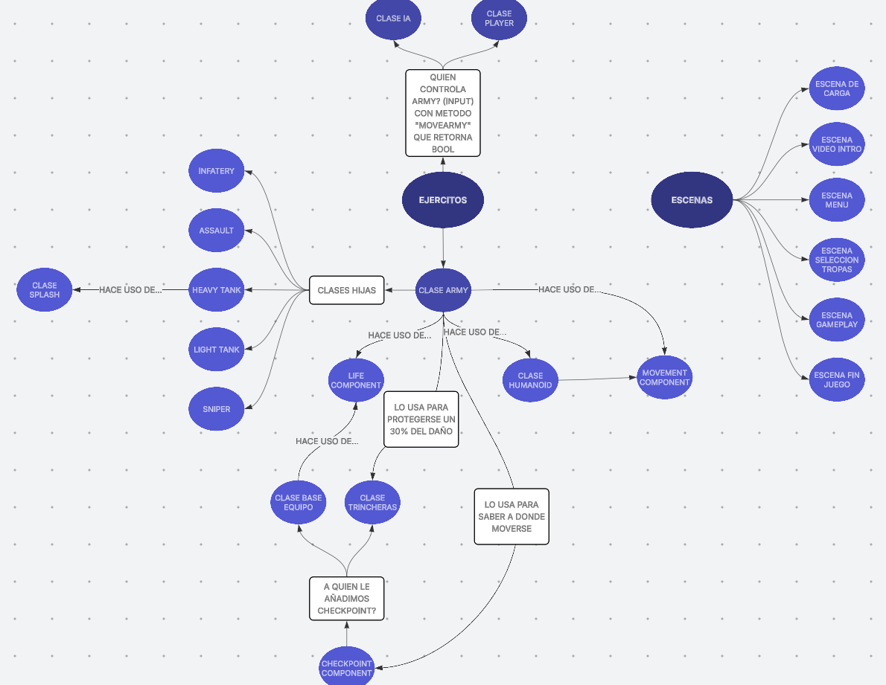
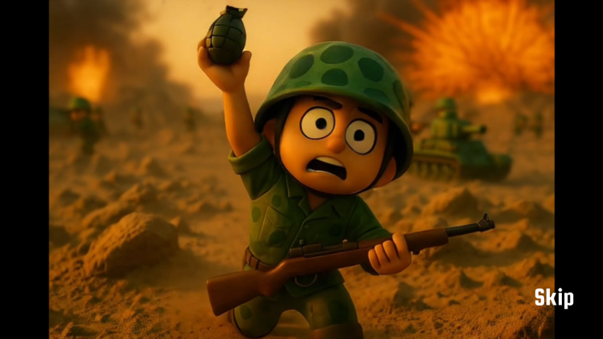
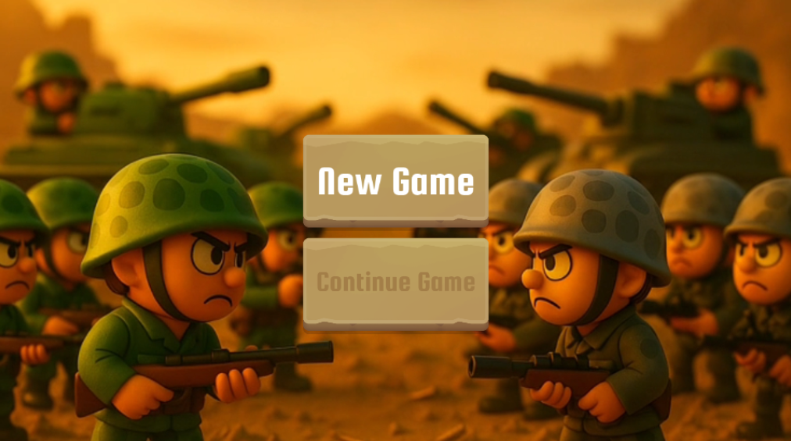
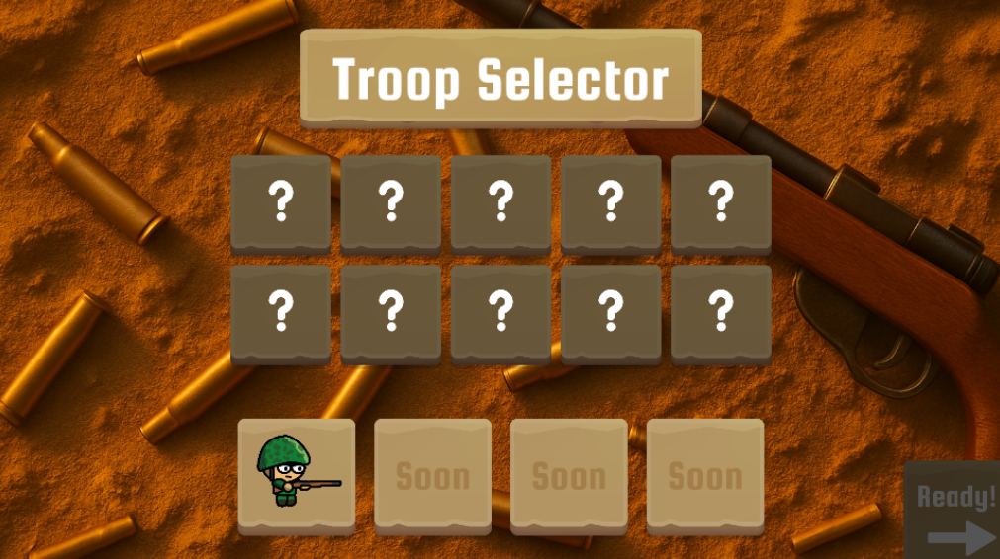
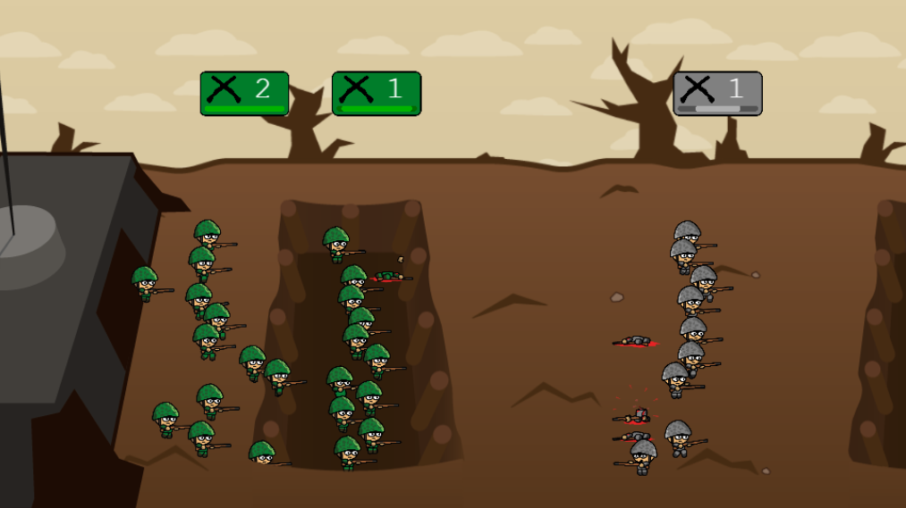
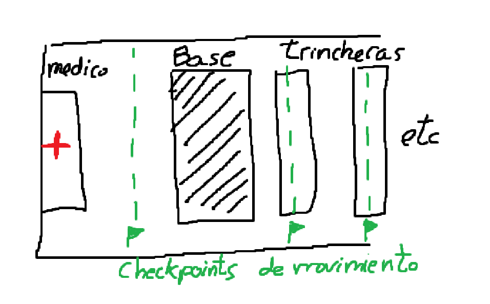

# Command The Trench Line — Game Design Document (GDD)

> **Nota**: Este proyecto es un **trabajo universitario**.  
> Versión del documento: 1.0

---

## Índice
- [1. Resumen](#1-resumen)
- [2. Esquema / Mapa Visual](#2-esquema--mapa-visual)
- [3. Pantallas](#3-pantallas)
- [4. Gameplay](#4-gameplay)
  - [4.1 Control y Movimiento](#41-control-y-movimiento)
  - [4.2 Daño y Combate](#42-daño-y-combate)
  - [4.3 Componentes](#43-Componentes)
  - [4.4 Armies](#44-Armies)
  - [4.5 Humanoids](#45-Humanoids)
  - [4.6 Checkpoints](#46-Checkpoints)
  - [4.7 Estructuras Especiales](#47-estructuras-especiales)
- [5. Clases de Tropas](#5-clases-de-tropas)
- [6. Sonido y Cámara](#6-sonido-y-cámara)
- [7. Arte y Estilo Visual](#7-arte-y-estilo-visual)
- [8. IA](#8-ia)
- [9. Hitos del Año](#9-hitos-del-año)
- [10. Bocetos y Estado Actual](#10-bocetos-y-estado-actual)
- [11. Enlaces y Capturas](#11-enlaces-y-capturas)

---

## 1. Resumen
**Título:** *Command The Trench Line*  
**Descripción breve:** Juego de **estrategia táctica** ambientado en trincheras. Controlas **pelotones (armies)** y tu objetivo es **destruir la base enemiga**. Hay diferentes tipos de tropas y debes gestionar el avance/retirada para coordinar la estrategia de juego.
**Pilares:**
- Decisiones rápidas de avance, retroceso y retirada.
- Posicionamiento en trincheras (ventajas defensivas).
- Composición de tropas (counter de tipos, alcance, velocidad).

---
## 2. Esquema / Mapa Visual
- [Mapa Visual/Arquitectura (Click)](https://lucid.app/lucidspark/b199ce75-16a2-4367-bb7c-02310af99a1b/edit?viewport_loc=-611%2C-139%2C5246%2C2513%2CgHjjwlkrc_Jt&invitationId=inv_0a35ce45-5fb9-4f64-a0cc-a690eb3825fb)
```text
Juego
├─ Armies (con diferentes clases que heredan)
│  ├─ Humanoids (soldados visuales)
│  ├─ MovementComponent (mover bandera de army y humanoids)
│  └─ LifeComponent (vida total de la army, barra visual)
│
├─ Estructuras
│  ├─ Trincheras (capacidad 3; bonus defensa)
│  ├─ Bases (destructibles; condición de derrota)
│  └─ Hospital (donde la army se puede curar tras retirarse)
│
├─ Sistemas
│  ├─ Sonido (posicional, volumen por cámara)
│  ├─ Cámara (edge panning)
│  ├─ IA (decidir avanzar/retroceder; perfil agresivo/defensivo)
│  └─ Checkpoints (control de movimiento)
│
└─ UX
   ├─ Carga / Intro / Menú
   └─ Selección de Tropas
```
<p align="left" style="margin-left:40px;">
  
</p>
---

## 3. Pantallas
**Pantalla de Carga**  
Descripción: Barra de progreso que se llena mientras los assets se cargan.

**Pantalla Intermedia**  
Descripción: Esta pantalla sirve para que el jugador haga su primer click y podamos empezar a reproducir sonido. La pantalla intermedia mostrará una animación tipo “Desvanecer” de una imagen de unos cascos, un texto “Sonido Recomendado” y un botón “Okay” (para ese primer click).

**Pantalla de Vídeo**  
Descripción: Vídeo introductorio épico con botón de "Skip" para iniciar. Debo generar un vídeo y música un poco mejores ya que el vídeo actual fue generado prácticamente con la primera IA que generaba vídeos y quedó algo obsoleto después de 1 año.

<p align="left">
  
</p>

**Pantalla de Menú**  
Continue: (no se va a implementar)
New Game: Inicia una nueva partida.  
Ajustes: (Tampoco la voy a implementar)

<p align="left">
  
</p>

**Pantalla de Selección de Tropas**  
El jugador pordrá elegir hasta 9 ejercitos para ir a la batalla. Mecánica de tipo "piedra, papel o tijera" con varios tipos de tropas que presentan ventajas y desventajas específicas entre ellas (se explica más adelante).

<p align="left">
  
</p>

---

## 4. Gameplay

<p align="left">
  
</p>

### Preparación de la partida:
1) Las armies empiezan cada una detrás de su base.
2) Mapa de batalla:
  - Se compone de dos bases de equipo a cada lado del mapa.
  -  Cada equipo, detrás de su base de equipo contiene una explanada plana y en el extremo del mapa unas tiendas de campaña a modo de hospital.
  -  El resto del mapa, es decir, entre las dos bases de equipo, se encuentran las trincheras.

### 4.1 Control y Movimiento
- **1–9**: seleccionar pelotón.
- **Flechas**: avanzar/retroceder entre líneas de trincheras.
- **Límite**: 3 pelotones por trinchera (si está llena, el army continúa).

### 4.2 Daño y Combate
- Daño automático a enemigos dentro de alcance (esto último depende del tipo de tropa).
- Siempre prioriza el **army enemigo más cercano**, salvo reglas específicas (p. ej., tanque pesado prioriza tanques).
- **Tipos de daño:**
  - **Normal**: afectado por distancia y por nº de soldados vivos en el pelotón.
  - **Área**: se elige un humanoide enemigo (pseudo-aleatorio con precisión X) y aplica splash. Para esto se implementará una clase splash a la que se le indica la posición, radio de explosión y daño.
- **Fórmula de daño:** Daño Total = Daño Base de la unidad * Multiplicador de Distancia * Número de soldados vivos.
- La distancia de disparo es prolongada a modo de bonificador cuando un enemigo huye.​

### 4.3 Componentes
#### LifeComponent: gestiona la vida y barra visual. Metodos para añadir vida
- Controla la vida actual y máxima de un objeto del juego.
- Actualiza automáticamente la barra de vida según el estado.
- Permite recibir daño o curación de forma uniforme.
- Detecta cuándo la vida llega a cero para activar su destrucción.
- Puede reutilizarse tanto en ejércitos como en estructuras.

#### MovementComponent: calcula direcciones normalizadas y velocidades según deltaTime.
- Mueve objetos hacia una posición objetivo usando velocidad y tiempo real.
- Calcula direcciones normalizadas para el movimiento.
- Permite cambiar o cancelar destinos dinámicamente.
- Proporciona información de orientación para animaciones y combate.

### 4.4 Armies
- **Descripción**: Cada equipo podrá contar con hasta 9 armies. Será una composición de humanoides que recibirán órdenes. Visualmente es la banderita de la Army.
- **Componentes**: 
    - Movement Component: para mover la bandera de la Army.
    - Life Component
- **Vida y bajas**:
  - Cuando baja la vida de la Army, **mueren soldados** de forma concordante.
  - Se usa un sesgo: **70%** muere el **más adelantado** y **30%** al azar.
  - El **último soldado** muere **solo cuando** la vida del Army llega a **0**.
- **Herencia**: Los tipos de ejercitos heredan de la clase Army (se explican detalladamente más abajo)
- **Estados**: función updateState(), enterState()
  - `Idle`, `Moving`, `InCombat`, `Fleeing`, `Healing`
  - En `InCombat`, no se puede ordenar movimiento **hacia** el enemigo (solo atrás).
  - En `Fleeing` y `Healing` no pueden recibir ordenes hasta que no termine de curarse.
- **Iconos**: dan feedback al jugador sobre el estado del Army.
- **Comportamiento del Army**:
  - Gestiona el estado general del pelotón (reposo, movimiento, combate, retirada y curación).
  - Coordina el movimiento conjunto del pelotón y de sus soldados.
  - Decide automáticamente cuándo entrar o salir de combate según enemigos cercanos.
  - Mientras está en combate, inflige daño continuo al objetivo actual.
  - La vida del pelotón y el número de soldados visibles están sincronizados: al perder vida, se reflejan bajas.
  - Cuando hay una baja, el soldado que muere se elige con un sesgo realista:
    - **70%** de probabilidad de morir el soldado **más adelantado** (en primera línea).
    - **30%** de probabilidad de morir un soldado **aleatorio** del pelotón.
  - El pelotón solo desaparece completamente cuando su vida llega a **0** (el último soldado cae al final).
  - Si el pelotón se retira, se desplaza hasta el hospital y entra en un periodo de curación donde no acepta órdenes.
  - Puede recibir bonificadores defensivos al estar estacionado en una trinchera (reducción de daño).
  - Al destruirse, se elimina del campo de batalla y se comprueba la condición de victoria/derrota.

### 4.5 Humanoids
- **Descripción**: Clase humanoide maneja animaciones/estados de cada humanoide por individual. Es decir, es una clase estética y visual para la clase Army. Estos humanoides no tendrán que hacer ningún tipo de cálculo, para eso está la clase army que les dice que animación, sonido etc deben hacer.
- **Componentes**: Movement Component: para mover los soldados.
- **Ordenes Delay**: Ellos tienen un método para ejecutar esas órdenes con un pequeño delay random.
- **Estados**: función updateState(), enterState()
  - `Idle`, `Moving`, `Atacking`, `Dying`
- **Comportamiento de los soldados**:
  - Reciben órdenes del Army y las ejecutan con un pequeño retraso aleatorio para dar sensación de desorganización realista.
  - Mantienen animaciones segun las ordenes que le dan.
  - Se desplazan individualmente hacia la posición indicada manteniendo la formación del pelotón.
  - Cuando atacan, disparan en ráfagas con pausas variables entre ellas.
  - Reproducen sonidos de disparo de forma aleatoria para evitar repetición.
  - Ajustan su orientación visual según la dirección de movimiento o el enemigo.
  - Al morir, reproducen su animación de muerte y dejan de responder a órdenes.

### 4.6 Checkpoints

Los **checkpoints** son un componente que puede agregarse a cualquier objeto del mapa que tenga una posición en el eje **X**.  
Su propósito es servir como puntos de referencia o “nodos” por los que los ejércitos (armies) se desplazan a lo largo del escenario.

- #### Atributos principales
    - **Máximo de ejércitos:** número máximo de pelotones que puede contener el checkpoint.  
    - Si se establece en `-1`, no hay límite máximo de pelotones.
    - **Ejércitos contenidos:** número actual de pelotones estacionados en ese checkpoint.

- #### Funcionamiento
    Los ejércitos utilizan los objetos con el componente **checkpoint** para desplazarse **de un punto a otro**.  
    Cuando el jugador da una orden de movimiento (usando las flechas), los ejércitos caminarán automáticamente **hasta el siguiente checkpoint más cercano** en la dirección indicada.

- #### Cálculo del checkpoint más cercano
    Para determinar el próximo destino, se utiliza una función en la escena principal llamada  
    `UpdateCheckpointsPositions`.  
    Esta función mantiene un **vector ordenado de los checkpoints** según su posición en el eje **X**,  
    permitiendo que los ejércitos identifiquen el punto más próximo hacia delante o hacia atrás.

- #### Integración con el mapa
    El componente **checkpoint** se aplica a:
    - **Trincheras**, para permitir el movimiento entre posiciones defensivas.
    - **Bases**, que funcionan como los extremos del mapa.

    Las bases actúan sin límite de capacidad (`-1`) para evitar que los ejércitos puedan salirse del área jugable.

- #### Comportamiento del checkpoint
    - Controla la entrada y salida de ejércitos.
    - Aplica bonificadores defensivos.
    - Mantiene organizados visualmente los ejércitos estacionados.
    - Permite detectar si una posición está llena y forzar a los ejércitos a continuar avanzando.
    - Actúa como referencia para que el movimiento de los ejércitos.

### 4.7 Estructuras Especiales
- **Trincheras**:  La clase trinchera usará el componente checkpoint. Gracias a esto, los pelones los cuales se mueven de checkpoint en checkpoint, se moverán de trinchera en trinchera. La trinchera puede acceder a las army estacionadas del checkpoint. Gracias a esto, la trinchera puede registrar ese army para poder aplicar un bonus de **protección a daños del 30%**. Se les pondrá un icono de un escudo a los armies que estén estacionados. La trinchera tiene capacidad **máx. 3** armies (eso es una propiedad de checkpoint)
- **Bases**: Cada equipo tendrá una base que proteger. Estas bases tendrán componente de vida. Una vez destruida, su equipo perderá la partida. La escena del juego comprueba si el componente de vida llega a 0 para la condición de derrota y por tanto fin de juego.
- **Tiendas de campaña / Hospital**: Las armies cuando huyen irán hasta esta zona la cual se encuentra en un extremo del mapa y se curarán ahí. Es un intercambio de tiempo por recuperación de vida. La recuperación de vida consiste en un 30% de la vida **mínima** que llegó a tener (mínima en toda la partida para que no se puedan curar de manera infinita). Por ejemplo, si una armie llega con 100 de vida, quiere decir que se puede curar 30 puntos de vida si su máximo de vida se lo permite y por tanto la recuperación de la vida será de 30 lo que hará un total de 130 de vida cuando salga del hospital. Cada punto de vida es 1 segundo. Los ejercitos priorizan atacar a otros ejercitos antes que a la base.

### Boceto Estructuras y Checkpoints:

<p align="left" style="margin-left:40px;">
  
</p>

---

## 5. Clases de Tropas
> (Sprites provisionales de infantería + icono de tipo)

| Tipo              | Daño             | Vida x Soldado | Velocidad | Alcance | # Tropas | Notas |
|-------------------|------------------|----------------|----------:|--------:|---------:|------|
| **Infantería**    | 10               | 100            | 15        | 300     | 15       | Tropa Base |
| **Asalto**        | 15               | 120            | 20        | 200     | 12       | Ideal para asaltar |
| **Tanque Pesado** | 300 (área)       | 1000           | 8         | 350       | 2        | Prioriza tanques |
| **Tanque Ligero** | 20               | 800             | 12        | 190       | 2        | Se usa para liderar la carga y absorber el daño |
| **Francotirador** | 15             | 80              | 13         | 400       | 4        | Unidad con mucho alcance |
| **Apoyo/Médicos** | —                | —              | —         | —       | —        | No se va a implementar por falta sprites y tiempo |
| **Granaderos**    | — (área)      | —              | —         | —       | —       |  No se va a implementar por falta sprites y tiempo |

**No implementadas (por ahora):** Artillería, etc.

**Vida de Tropas:** Cada Army tiene barra de vida. Se puede **retirar a base** para curar y reponer antes de ser destruido (mecánica diseñada; implementación futura si da tiempo).

---

## 6. Sonido y Cámara
- **Sistema de Sonido**: El volumen varía. Permite al jugador escuchar el conflicto según la posición de la cámara en el mapa. Sonidos realistas. Los soldados dicen frases con palabrotas con una voz de pito. Las palabrotas se censuran.
- **Cámara**: *edge panning* (desplaza al llevar el cursor a los bordes).

---

## 7. Arte y Estilo Visual
- **Dirección**: *hand-painted* infantil + **estética sangrienta** (contraste cómico).
- **Inspiración**:
  - Tiny Armies - 2D Tiny Army Character Sprite
  - World War II Pixel Weapons Pack
- **Animación**: Desplazamiento en capas, simulando profundidad. Low frame-rate hecha a mano.
- **

---

## 8. IA
- Al bajar a **50%** y **25%** de vida: **50%** probabilidad de **retirada**.
- Tendencia general a **avanzar más que retroceder**. 
- Adelantar tropas que **counterean** a las del rival; retrasar tropas en **desventaja**.
- La IA registra lo fuerte que se siente en base a la vida de sus ejércitos.
- Dos perfiles básicos. Cuando la IA se note fuerte optará por el agresivo.
  - **Agresivo**: avanza con mayor frecuencia.  
  - **Defensivo**: retrocede más a menudo. Posición más defensiva, menos movimientos.
- Como checkpoint devuelve las Army, si detecta que hay ya 3 en una trinchera les manda a los 3 a que ataquen.
- Juega con el mismo numero de ejercitos que tu. Si eliges 3, ella juega con 3.

---

## 9. Hitos del Año
- Arreglar los soldados que funcionan mal debido al delay de sus órdenes (algo que hace que se vea mucho mejor y a lo que no quiero renunciar como comentamos en una ocasión) En resumen, un pequeño refactor. ✅  
- Army tiene lógica del LifeComponent (tiene las barritas de vida) y viceversa (LifeComponent tiene métodos que deberían ser de Army). ✅  
- Actualmente los soldados de las armies mueren antes de que la army se quede sin vida. Hay que cambiar la implementación del Life Component para que justo cuando muera el último soldado, la vida del army sea igual a 0. ✅  
- Que muera el soldado que esté más adelantado con probabilidad 70% y 30% es aleatorio y no como lo hacen ahora que lo hacen de abajo a arriba y queda muy mal. ✅  
- Sonidos, voces graciosas, más sprites necesarios, efectos (balas, explosiones etc). ✅  
- Escalar y mejorar la web ✅  
- Los sonidos deben reproducirse en una posición y tener en cuenta la lejanía de la cámara. 
- Que las armies no se salgan del mapa. Para ello implementaremos la clase checkpoint nombrada anteriormente. Los checkpoints de los dos extremos (que no serán trincheras) no tendrán límite de armies que pueden estacionarse. De esta forma evitaremos que se salgan de la pantalla. ✅ 
- Crear una clase trinchera en la que las armies puedan entrar y protegerse. Tendrá un límite de 3 armies dentro. El resto de armies que vayan llegando no podrán refugiarse si ya hay 3 y por tanto seguirán avanzando. ✅
- Ahora mismo la IA solo mueve armies de forma aleatoria. Hay que mejorarla para que juegue mejor.  
- Las bases destructibles para poder ganar. Para ello las armies deberán poder hacer daño a cualquier cosa que tenga LifeComponent (podemos poner un atributo de team a ese componente) y no como está ahora que simplemente busca armies. ✅
- Primera pantalla, en vez de "Play" mejor una anim chula de imagen desvaneciéndose y texto "Sonido Recomendado" y un botón de “Okay”.  
- Nueva tropa “Tanque”. Dispara proyectiles explosivos. Cuando se queda sin proyectiles explosivos, sale un soldadito de arriba y comienza a disparar. El tanque debe hacer focus a otros tanques. Renta mandarlo asaltar una trinchera cuando está ya sin proyectiles explosivos ya que llegados a ese punto solo sirve de escudo humano.  
- Otras tropas que usarán el mismo spritesheet que el de infantería pero le pondré iconos a cada uno para diferenciarlos. Implementaré tropas ya especificadas arriba como asalto, francotiradores, granaderos, etc. ✅
- Mejorar la GUI. ✅
- Daño basado en la distancia, tipo y número de soldados. ✅
- Daño en area, crear la clase splash para generar explosiones en una posicion concreta.
- Retirada de las armies al hospital y curación. ✅
- Dar algo mas de feedback al jugador tanto con iconos al entrar en trincheras, retirarse, atacar y curarse como con las voces. ✅

**Opcional (cosas que no creo que vaya a hacer):**
- Las tropas tienen ahora una barra de munición debajo de la barra de vida.  
- Ajustes (sonido etc).  
- No podrás ver a los enemigos si están muy lejos dependiendo de la distancia de visión de cada army.  
- Habilidades: lanzar habilidades. Por ejemplo, el jugador puede clickear en una zona y los morteros dispararán y caerán explosiones pasados 2s.  
- Tropa de munición → habilidad: reparte su munición a los de la misma trinchera (tienen mucha munición pero son tropa débil).  
- Médico (nueva tropa) → habilidad: cura a los de la misma trinchera gastando munición (son una tropa no tan débil pero algo débil). La IA debería intentar mantener a los médicos en una posición secundaria mientras tuvieran munición para poder mandar atrás tropas dañadas y curarlas.  
- Cuando tienes un pelotón seleccionado puedes ordenarle una retirada; la retirada evitará bajas pero tendrán que retirarse hasta la base perdiendo posiciones.  
- Animación/estado de entrar a la trinchera y escalar la trinchera para salir.  

---
## 9. Narrativa
El juego se ambienta en una guerra ficticia inspirada en los conflictos de trincheras de principios del siglo XX.
No hay héroes ni grandes estrategias, solo órdenes, barro y supervivencia. Cada avance cuesta vidas, y cada retirada, territorio.
El jugador asume el papel de un comandante que intenta mantener la línea mientras todo a su alrededor se desmorona.

## 10. Gameplay Video
- [GameplayVideo (Click)](https://youtu.be/m7nuxFr0Tqs)

## 11. Enlaces y Capturas
- **Web pública (GitHub Pages):** [link](https://alvapina.github.io/CommandTheTrenchLine/) 
- **Repositorio:** [link](https://github.com/AlvaPina/CommandTheTrenchLine)  