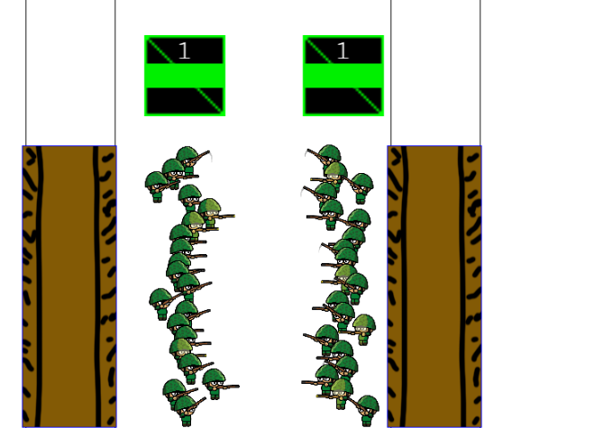

# Command The Trench Line

Bienvenido a **Command The Trench Line**, un juego de estrategia táctica de trincheras. Este proyecto es un trabajo universitario.

---

## 📝 Descripción General

En **Command The Trench Line**, controlas y posicionas pelotones para tomar y defender trincheras. En futuras updates tendrás que gestionar recursos como monedas, materiales y soldados. Para la Beta se eligirá cuidadosamente las tropas adecuadas para enfrentarte al enemigo sabiendo combinar tus tropas y moverlas adecuadamente ¡Destruye la base enemiga para la victoria!

### Puntos Clave:
- **Gestión de Recursos**: Recolecta monedas, materiales y soldados para reforzar tus tropas (no estará para la Beta)
- **Selección de Tropas**: Desde infantería básica hasta tanques avanzados, cada unidad tiene su rol en el campo de batalla y sus propias ventajas y desventajas.
- **Estilo Visual**: Gráficos de arte handpainted con una estética cartoon, sangrienta y cómica.
- **Sonido Inmersivo**: Efectos de sonido reales con palabras censuradas de tus tropas.

---

## 🎮 Capturas del Juego

---

## 🌐 Página Web Pública

Prueba el juego en su versión publicada aquí: [Command The Trench Line](https://alvapina.github.io/CommandTheTrenchLine/)

---

## 📱 GDD

- [Game Desing Document Link](https://docs.google.com/document/d/1dfmlh_B2gY8Bidv1JY2kcPE-pw0b2B_AI9-840cx3kk/edit?usp=sharing)

---

## 📱 Redes Sociales

- [Twitter](https://x.com/DummyStudiosUCM)

---

¡Gracias por visitar **Command The Trench Line**! 🎉