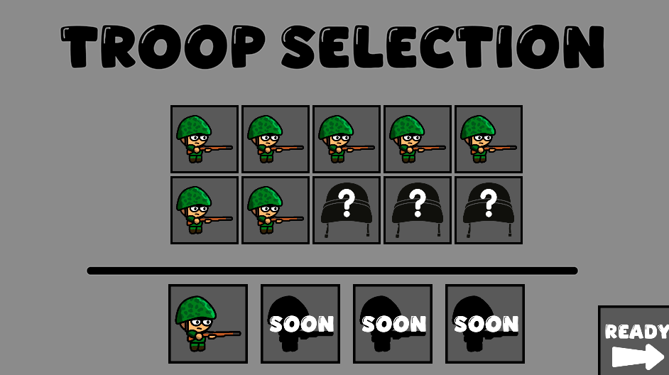

# Command The Trench Line

> **Nota**: Este proyecto es un **trabajo universitario**.  
> Versión del documento: 1.0

Bienvenido a **Command The Trench Line**, un juego de estrategia táctica de trincheras. Este proyecto es un trabajo universitario.

## Documentación
- 👉 [Game Design Document (GDD)](GDD.md)
- 👉 [Assets / Dirección Artística](Assets.md)
---

## 📝 Descripción General

En **Command The Trench Line**, controlas y posicionas pelotones para tomar y defender trincheras. Decide sabiamente como combinar tus tropas para ¡Destruye la base enemiga para la victoria!

Este proyecto forma parte de un trabajo universitario de la UCM.

## 🕹️ Características Principales

- ⚔️ **Combate por Pelotones:** Controla múltiples ejércitos, asignales posiciones y haz que avancen hacia la victoria! El daño depende de la distancia, el tipo de tropa y la cantidad de soldados vivos.
- 🧠 **IA Dinámica:** Los ejércitos enemigos se adaptan y responden a tus movimientos. Próximamente con comportamientos más complejos.  
- 🚜 **Variedad de Tropas:**  
  - Infantería básica  
  - Tropas de asalto (más rápidas y resistentes pero menos numerosas)  
  - Tanques con proyectiles explosivos y modo de respaldo (soldado conductor)  
- 🏰 **Trincheras Defensivas:** Hasta 3 pelotones pueden refugiarse por trinchera; el resto debe continuar el avance!
- 🔊 **Sonido Inmersivo:** Voces cómicas, efectos realistas y sistema de audio posicional según la cámara.
- 🎨 **Estilo Visual:** Arte **handpainted** con estética **cartoon sangrienta y humorística**, completamente original y hecha a mano.

---

## 🎬 Flujo del Juego

1. **Pantalla de Carga:** proceso de carga de assets.  
2. **Pantalla Intermedia:** animación con aviso de “Sonido Recomendado” y botón *Okay*.  
3. **Intro Cinemática:** vídeo épico introductorio con música y opción *Skip* (generado con IA).
4. **Menú Principal:** opciones de *New Game* (solo funcional), *Continue* y *Settings* (deshabilitadas).  
5. **Pantalla de Selección de Tropas:** elleción de tropas, cada una con ventajas y desventajas respecto de otras unidades.
6. **Campo de Batalla:** control de pelotones, ataques, retiradas, trincheras y habilidades.

---

## 🗓️ Hitos de Desarrollo 2025 (consultar GDD para más detalle)

- ✅ Un poco de Refactor.  
- ✅ Correcciones de sistemas como el sistema *Life Component* para sincronizar soldados y pelotón.  
- ⚙️ Implementaciones nuevas como *Trench Class* para gestión avanzada de trincheras.  
- 🔊 Posicionamiento de sonido dinámico.  
- 💥 Efectos visuales (balas, explosiones, impactos).  
- 🧠 Mejora de la IA.  
- 🪖 Nuevas tropas y balance de combate.  
- 🧩 Mejora completa de la interfaz de usuario (GUI).

---

## 🖼️ Capturas del Juego

| | |
|:--:|:--:|
|  |  |
|  | |

---

## 🌐 Juega Ahora!

👉 **[Probar Command The Trench Line en GitHub Pages](https://alvapina.github.io/CommandTheTrenchLine/)**

---

## 📱 Redes Sociales

- [Twitter](https://x.com/DummyStudiosUCM)

---

## 🧑‍💻 Créditos

**Desarrollado por:** Álvaro Piña Sánchez-Sierra 
**Motor:** Phaser 3  
**Profesor:** Antonio Calvo Morata
**Universidad:** Universidad Complutense de Madrid

¡Gracias por visitar **Command The Trench Line**! 🎉